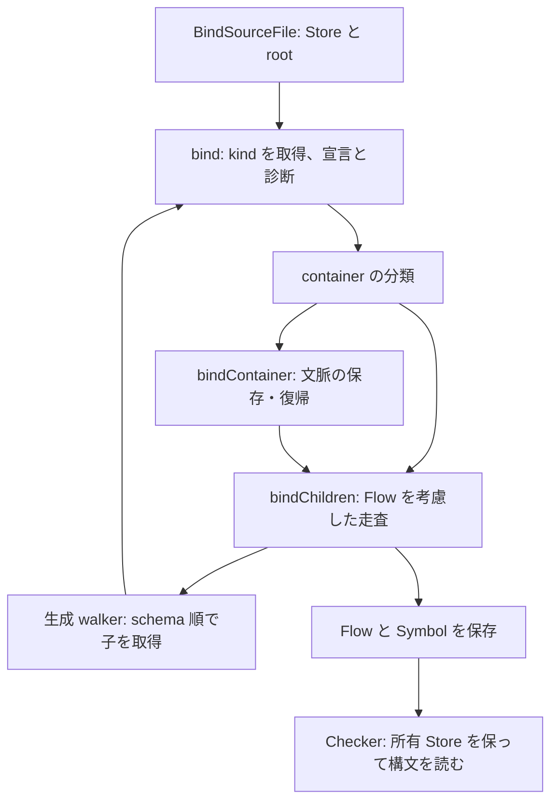

# Binder 呼び出し境界の再設計

2026-09-15。対象は `80d8b41ccfb046a551b721cb04f909205d66513a`。**設計提案であり、実装・追加ベンチマーク・性能改善の採用は行っていない。**

実装順序・担当AIモデル・最新の採用条件は[実装・検証指示書](binder-call-implementation-instructions-20260915.md)に従う。検証頻度はそちらを優先し、各変更ではmicroと通常GCのBinder benchを使い、KPCは低頻度に限定する。

## 結論

**永続的な参照と、処理中の情報を分け、関数には判断に必要な最小の入力を渡す。** `Handle → NodeRef` の一律置換は選ばない。Handle は kind を保持しており、ref だけにすると再読が増える。反対に、kind や修飾子列だけで済む関数へ node 全体を渡す必要もない。

推奨する構造は次のとおり。

1. Binder の状態・遅延処理は引き続き Store 相対の `NodeRef`。現在ノードの kind は `bind → bindContainer / bindChildren → generated walker` の短い区間で受け渡す。
2. AST の共通クエリを、必要な情報を受け取る共通実装へ変える。識別子名判定は `(Store, NodeRef)`、修飾子集計は `ListRef`、構造を見ない分類は `Kind` を受ける。公開 Handle 入口はその実装への所有権を保つアダプターにする。
3. **問い合わせの回数を減らす。** 通常識別子では親の検査を避け、非 constructor parameter では修飾子走査を避け、条件式の true/false は一度の構文分類から接続する。
4. 永続的な Flow の表現変更は別の設計単位とする。今回の主案では `newFlowNodeEx` が保存すべき `Handle` を直接受ける。すでに持っている Handle を ref に戻して再構成しない。

これは旧改善計画の「各関数内で再利用する」より広い再設計である。一方、構文全体の別コピー、全 node context、祖先スタック、汎用 reader interface、modifier cache は主案の必須要素にしない。

## 1. Problem — 何を減らすか

Binder が本当に行う仕事は、構文と文脈から Symbol・診断・Flow を作ること。同じ構文ノードの Store・kind・親・list header を再び探すことは成果物に必要な仕事ではない。

ただし次を区別する。

- **再解決**：同じ node の kind、同じ list の owner/start/length を読み直す。
- **重複した意味クエリ**：同じ式を true/false それぞれで narrowing 判定する、同じ宣言の root を複数の述語が探索する。
- **不要なクエリ**：予約語でない識別子に対する IdentifierName 判定など。
- **本来必要な仕事**：子の初回 kind 取得、診断順序、Symbol の衝突検査、Flow の生成と接続、foreign owner の保持。

最適化の優先順位は、不要な仕事を消す → 重複したクエリを統合する → 残った解決を短くする、という因果関係から決める。実装・検証は独立した差分に分ける。

## 2. Ground — 現行の動作と、変えてよい契約

### Overview / Key concepts

`BindSourceFile` は `ParseTreeRef()` から Store と root を得る。Binder は一つの Store を持ち、同一ファイルの node を ref で走査する。Store は bind 中には build phase で、Flags / Symbol / Flow / Locals の更新がある。Program は各ファイルの bind 完了後に parse Store を Freeze する。

`Handle` は `{*Store, NodeRef, Kind}` の値であり、`Store.At` は kind を読む。`HandleOf(store, ref, knownKind)` は読まない。`NodeRef` は永続 identity、kind は現在の判断材料、Handle の Store pointer は別 Store と寿命を含む参照の一部である。

### How it works



`bind` はすでに kind を持つが、`bindChildren`、`bindContainer`、`bindEachChild` では再取得する。生成 walker はすでに `(ref, kind)` を受け取る。list では `ListLen / ListElem` が owner/header を繰り返し解決する。`TryBindListSpan` はこの一部をループ外へ移す既存 API である。

Flow の `Node` は実際の構文 Handle、`Data *Node` は switch/reduce 用の合成 payload。Checker は Node の親・引数・式などを読む。Store の Flow 列には local ID と foreign Flow の経路があるため、単に FlowNode.Node を裸の ref に置換しても読み手の owner は確定しない。

### Where things live

| 責務 | 現行ソース |
| --- | --- |
| bind 入口・文脈・条件分岐 | `tsc/internal/binder/binder.go:93,603,1486,1659,1809` |
| schema 順の走査 | `tsc/internal/binder/bindwalk_generated.go:7` |
| walker / accessor 生成元 | `tools/scripts/tsc/generate-go-ast.ts:1063` |
| NodeRef / Handle / list / parent | `tsc/internal/ast/store.go:13,90,522,617,1246` |
| list span | `tsc/internal/ast/store_bind_span.go:3` |
| IdentifierName / modifier semantics | `tsc/internal/ast/utilities.go:299,614,1019,1065`、`store_query_manual.go:226` |
| Flow 表現と消費 | `tsc/internal/ast/flow.go:27`、`tsc/internal/checker/flow.go:387,415,469,531` |

### Why — 理由として確認できたこと

- **Direct**：Store の長期参照を NodeRef にする目的は GC scan の削減。現行 `store.go:85` と初期 commit `02104b4046` に記録がある。短命の引数もすべて NodeRef にする要請ではない。
- **Direct**：Handle の cached kind と HandleOf は header 再読を避けるための設計（`813646886c`、`e9a45053f4`）。foreign Handle は identity と owner lifetime を保つ設計（`67caa0b3e6`）。
- **Direct**：kind 非伝搬は移行時の基準形。変換規約自身が `bind(NodeRef, Kind)` を性能候補として残している（`upstream-to-store-translation.md:39,434`）。今回のユーザー指示により、この基準形も再設計対象である。
- **Inferred**：保持表現と実行中の引数を分ける方が、この所有権と再取得問題に適合しそうである。速度の優位は未実証。
- 過去の親引数・ancestor・借用実験は、ある構成が CALL / spill / frame 拡大で相殺された根拠である。すべての context 型や kind 伝搬への一般的反証ではない。旧 revision の性能値は今回の採用根拠に使わない。

### Gotchas — 所有権と寿命

- `ParentRef()==0` は「親なし」と「external parent」を区別しない。公開 query は `Handle.Parent()` 相当を保つ。
- `ChildRef()==0` は missing または external child。`ListElem` は foreign list owner を解決し、**その owner に相対的な ref** を返す。元の `b.store` で解釈する fallback は不正。
- `TryBindListSpan` の成功は local list header の証明であり、local 要素すべての証明ではない。
- 主走査は通常 parser の同一 Store parse tree が対象で、任意の foreign synthetic tree を bind する機能ではない（変換規約:251）。この生成経路・root/list owner・external child/list を境界テストで監査する。未証明の一般 query を、この主走査の前提だけで local 化しない。
- Span は同じ Store、list start/length 不変の短い区間に限定。Compact / Restore / list header 編集をまたがず、要素値は再読する。Flags 更新は構文不変の証明ではない。Kind の保持も同じ node identity/shape が保たれる範囲だけにする。

## 3. 既存証拠と状態

選択 repo：`/Volumes/SanDisk1TB/worktree/binder-rewrite`。HEAD は B=`80d8b41ccfb046a551b721cb04f909205d66513a`、A=`85506e8b7d51f2b05f84f9ba1a8c3309b2f30ce4`。作業開始時の差分は文書だけで、production Go source に差分はなかった。

候補 clone / checkout：`cursor-ast-store-tests`（A）、pointer `main`、`flownode`、`lock-design-inv`、`lock-profile`、`store-pr-*` など。今回これらの source を混ぜていない。全一覧は artifact set の `worktrees.txt`。設計候補 A〜D 用の実装 clone は作っていない。

Artifact set：`/Volumes/SanDisk1TB/Library/Caches/binder-85506e8-80d8b41-20260915-run1`。`identity.json` の `repo_root`、`tsgolint_git_rev=null`、`typescript_go_git_rev=B` を選択 checkout と照合した。保存済み raw の Benchmark 行と `analysis/{wall-natural,pmu-gc_off}/primary.benchstat.txt` を読み、既存比較を再利用した。

| artifact / stage | status | 制約 |
| --- | --- | --- |
| 主 A/B raw・benchstat・操作数・Instruments・意味監査 | `current` | 設計候補の効果を示すものではない |
| 既存 span 候補 wall | `current` | 精度不足。改善確定に使わない |
| span 候補 KPC、今回の設計候補の性能・正確性結果 | `missing` | 新規実行なし |
| 別 revision の過去実験 | `stale` | 歴史的な失敗機構の参考のみ |
| 今回参照した主 raw | `current` | 要求対象の Benchmark 行あり。該当 `unsupported` stage なし |

artifact が存在しても要求 regex の `Benchmark...` 行がなければ `unsupported`、未取得なら `missing` とする。鮮度と測定精度は別判定。

| 入力 | ns/op A → B | B/op A → B | allocs/op A → B |
| --- | ---: | ---: | ---: |
| checker.ts | 16,088,731.0 → 18,266,012.5 | 12,798,224.0 → 12,777,532.5 | 14,163.0 → 14,165.0 |
| dom.generated.d.ts | 6,059,273.0 → 6,880,706.0 | 7,869,560.5 → 7,867,973.5 | 16,682.5 → 16,683.0 |

保存済み benchstat では命令数 +20.97% / +20.80%、cycles +16.12% / +14.09%。主・確認用とも p=.002、命令/cycles の A/A 条件は達成。wall の観測差 +13.53% / +13.56% は A/A 精度未達で、確定した時間回帰率とはしない。新候補との比較は結果がなく **比較不能**。

**Hot paths**：広い対象は walk/helper 全体。B の exclusive leaf は checker の bind 13.73%、bindChildren 6.05%、checkContextualIdentifier 5.16%、GetContainerFlags 2.34%。dom は bind 10.55%、bindChildren 3.64%、declareSymbolEx 2.97%。狭い list span は取り組みやすい一部分であり、全体回帰の説明ではない。

**Allocation drivers**：Flow・列・Symbol・Locals が候補。今回その全 allocation stack に増分を帰属していない。M で増えた約9,900 allocs/op の引数 slice は B で解消済み。今回の回帰をその割り当てで説明しない。

**Diagnosis**：同じ node 訪問数・Flow 生成数でも再解決が増えた。新設計は不要な query と繰り返す解決を標的とするが、約21%の回帰を何割解消するかは未確定。

## 4. Usage — 呼び出し側から決める新しい形

以下は**提案 API / 疑似コード**。現行 API として呼び出せるコードではなく、コンパイル対象への scaffold 追加もしていない。

### 4.1 同じ node の処理中は kind を失わない

```go
func (b *Binder) bind(node ast.NodeRef) bool {
    if node == ast.NoNodeRef { return false }
    kind := b.store.KindAt(node)
    // 現行の宣言・診断 switch はこの本体に残す。
    // 現行の childless/JSDoc/Flags 等の条件も維持する。
    // ...
    flags := b.containerFlags(node, kind)
    if flags != ContainerFlagsNone {
        b.bindContainer(node, kind, flags)
    } else {
        b.bindChildren(node, kind)
    }
    return false
}

// 通常の generated walker は child ref の初回 kind をまだ持たない。
b.bind(accessor.Condition)
// 現在 node の子走査には既存の kind を渡す。
b.forEachBindChildGenerated(node, kind)
```

新しい `bindRef → bindNode → bindKnown` の中継階層は作らない。全 helper に kind を追加せず、現在 node の再 dispatch をする境界だけ変える。単一 kind 専用関数では既知の定数を使える。子の初回取得を親へ移すだけの変更には効果を計上しない。

### 4.2 必要なのが修飾子列なら、修飾子列を渡す

```go
p := b.store.AccessParameter(node)
parent := b.store.ParentRef(node) // 主走査の local parent 契約内
if b.store.KindAt(parent) == ast.KindConstructor &&
   b.store.ModifierFlagsOf(p.Modifiers)&ast.ModifierFlagsParameterPropertyModifier != 0 {
    // 現行と同じ位置で class property symbol を宣言する。
}

// 一般の Handle caller も同じ集計実装へ入る。
func (h Handle) ModifierFlags() ModifierFlags {
    if h.IsNil() { return 0 }
    return h.Store().ModifierFlagsOf(h.Modifiers())
}
```

callee は修飾子列の意味を完結させ、ノードの kind / modifiers slot を探し直さない。decorator の bind 自体は別途そのまま行う。

### 4.3 条件分岐は両側を一つの操作として接続する

```go
// bindCondition / logical assignment / optional-chain の既存の接続位置で。
b.addConditionAntecedents(node, trueTarget, falseTarget)
```

この API が同じ式の narrowing 判定を一度だけ行い、true の create→add、false の create→add を現行順序で実行する。caller は内部の分類結果を二度渡したり、Flow を二つ作って後から接続したりしない。

## 5. Shape — 型、責務、共通実装

### 5.1 参照を選ぶ基準

| 必要な情報 | 引数・保持形式 | 適用例 |
| --- | --- | --- |
| 同一 Store の永続 identity | `NodeRef`。owner は Binder/Store が保持 | container、遅延 expando |
| 現在 node の再 dispatch | `NodeRef, Kind` を狭い区間で渡す | bindChildren / bindContainer |
| kind のみ | `Kind` | container の構造不要な分類 |
| ある node の親と name identity | Store receiver + `NodeRef` | IsIdentifierName |
| 修飾子の集合 | owner 付き `ListRef` | ModifierFlagsOf |
| 構文の範囲を繰り返し走査 | local `BindListSpan` | bindEach、functions-first |
| Store をまたぐ、または owner を保持して保存 | `Handle` | 一般 AST 境界、Flow.Node |

`ast.NodeRef` の型だけでは Store 所属を静的保証できない。新しい opaque token を足しても、その token を別の Store receiver へ渡せれば同じ問題が残る。本案は既存の Binder owner、生成入口、境界検査で保証し、この限界を型安全と称さない。

### 5.2 Container 分類：kind の規則は一つ、構造取得は必要な分岐だけ

```go
// binder package。公開関数もここにある（ast.GetContainerFlags ではない）。
func GetContainerFlags(node ast.Handle) ContainerFlags { panic("not implemented") }
func (b *Binder) containerFlags(ref ast.NodeRef, kind ast.Kind) ContainerFlags {
    panic("not implemented")
}

type containerRule struct {
    base  ContainerFlags
    probe containerProbe // none / method-parent / initializer / block-parent
}
type containerProbe uint8
const (
    probeNone containerProbe = iota
    probeMethodParent
    probeInitializer
    probeBlockParent
)
func ruleForContainer(kind ast.Kind) containerRule { panic("not implemented") }
```

kind→規則の意味は一つにする。必要なら predicate 結果→flags も同じ pure evaluator に置く。Handle 側は owner-aware 読取、local 側は対応する ref getter を使う。Block、method/accessor、PropertyDeclaration の例外を忘れない。query が必要な分岐だけ parent / initializer を読む。

これは「全 kind の facts struct を先行取得する」API ではない。rule は switch でもよく、table 化による分岐削減・inline を事前に約束しない。二つの入口で大きな意味 switch を複製しない。既知 kind の HandleOf を使うだけの単純案も対照に残し、probe 層の追加費が勝てなければそちらへ縮める。

### 5.3 IdentifierName：Store 所属を受け取る一つの query

```go
// ast package。現在の自由関数を互換入口として残す。
func IsIdentifierName(node Handle) bool {
    if node.IsNil() { return false }
    return node.Store().IsIdentifierName(node.Ref())
}
func (s *Store) IsIdentifierName(ref NodeRef) bool { panic("not implemented") }
```

判定に必要なのは対象の identity と親の構文で、対象 node 自身の kind ではない。この入口なら node の Handle を復元するためだけの KindAt を消せる。

内部で local parent ref / parent kind を読み、親 kind に対応する `Name / QualifiedName.Right / PropertyName / always-true / false` の規則を一つの場所で選ぶ。local の選択スロットは ref を比較する。parent や選択 child が external の場合は、private な owner-aware 評価へ進み、Store と ref の identity を比較する。`ParentRef==0` を無条件 false としない。公開関数へ戻って再び同じ Store method に入る再帰 fallback は作らない。

役割判定を Binder にコピーしない。名前の schema slot を扱うコードが必要なら AST の生成元へ置き、slot 番号を Binder に露出させない。nil・全親 kind・foreign parent/child・同じ ref 数値の別 Store を境界試験に含める。正常な Handle の cached kind と identity が一致する既存契約が前提である。

`checkContextualIdentifier` は既存の diagnostics / Ambient / JSDoc gate を保った後、`GetIdentifierToken(TextAt(ref))` を先に判定する。通常 Identifier なら return。keyword にだけ IdentifierName と元の診断条件を評価する。`GetIdentifierToken` は文字列判定で副作用がない（`scanner.go:2024`）。ただし、従来は親で短絡した property/import/JSX 名への追加文字列処理を得失として測る。parser に keyword cache を新設する必要はない。

### 5.4 Modifier：列の所有者が集計を完結させる

```go
// ast package。ListRef は owner を含む。nil は 0。
func (s *Store) ModifierFlagsOf(list ListRef) ModifierFlags {
    panic("not implemented")
}
```

内部で owner と list header を一度解決し、各要素の kind を OR する。local 要素は owner の header を読み、external 要素は対応する Handle の kind を使う。0/missing と decorator は既存の `ModifierToFlag` に従う。Handle 列や一時 slice を作らない。

この共通実装に `Handle.ModifierFlags` と Binder を接続すれば、ref 版・Handle 版で集計規則を二重管理しない。`ParameterAccessor.Modifiers` のようにすでに取得した list があれば、そのまま使う。has-mask の早期終了は別最適化として評価し、最初から API を増やさない。

### 5.5 宣言：root 探索を意味のある問い合わせにまとめる

`bindVariableDeclarationOrBindingElement` の require / block-catch / parameter の複数述語は、どの Symbol を宣言するかという一つの判断に使われる。主走査用の `variableDeclarationFlags(ref, kind)` にまとめる案を置く。

```go
// Binder private。診断と table への書込みは呼出側の元位置に残す。
func (b *Binder) variableDeclarationFlags(ref ast.NodeRef, kind ast.Kind) (
    includes ast.SymbolFlags, excludes ast.SymbolFlags, blockScoped bool,
) { panic("not implemented") }
```

require の直接分割代入条件、BindingElement から root declaration へ上がる規則、VariableDeclarationList / VariableStatement の combined flags、catch、parameter を保つ。すべてを直近親だけで判断しない。必要なら AST 共通側に小さな root/所属の問い合わせを置き、既存述語も同じ規則へ接続する。祖先すべての snapshot や全 node cache は不要。

この項目は shared AST utilities の意味を重複させやすいので、共通規則を抜き出せない段階では実装を見送る。単なる `getA / getB / getC` の forwarding 関数にしない。container Symbol の二重取得削減は、この改修に依存しない独立差分である。

### 5.6 Flow：同じ式を一度分類し、更新は元順序で行う

現行 `createFlowCondition` の全10 call site は、同じ expression と currentFlow を使う5組の true/false 隣接呼び出しである（`binder.go:1812,1819,2332,2453,2464`）。この消費形に合わせて単一極性の API を置き換える。

```go
func (b *Binder) addConditionAntecedents(
    expression ast.NodeRef, trueTarget, falseTarget *ast.FlowLabel,
) { panic("not implemented") }

// 保存する値を直接受ける。Known / Ref の兄弟 helper を増やさない。
func (b *Binder) newFlowNodeEx(
    flags ast.FlowFlags, node ast.Handle, antecedent *ast.FlowNode,
) *ast.FlowNode { panic("not implemented") }

// 両側接続関数の中でだけ使う、一回の構文分類の形。
// Flow の mutable flags や antecedent の値 snapshot は含めない。
type conditionMode uint8
const (
    conditionReuseAntecedent conditionMode = iota
    conditionUnreachable
    conditionCreateNarrowing
)
type conditionShape struct {
    node ast.Handle
    whenTrue, whenFalse conditionMode
}
```

`addConditionAntecedents` の内部手順：

1. 現在の antecedent を取得する。unreachable、expression=0 は従来どおり処理し、不要な構文 query をしない。
2. 一つの expression Handle と構文分類を用意する。narrowing を一度判定し、true/false literal の不可能な極性も分類する。optional-chain-root と nullish 親の例外を維持する。
3. **true 側の create → addAntecedent → false 側の create → addAntecedent** をこの順で実行する。構文分類だけを再利用し、Flow flags の値をキャッシュして上書きしない。
4. `Referenced / Shared` の変更、既存 antecedent の重複判定、Flow ID と FlowList の生成順を維持する。同じ true/false target や antecedent と target の alias を試験する。

`conditionShape` はこの一回の呼び出し内でのみ保持する。missing expression は `(reuse, unreachable)`、通常の non-narrowing は `(reuse, reuse)`、narrowing は `(create, create)`、literal は既存の optional/nullish 例外を調べて不可能な極性を unreachable にする。新しい汎用 cache や外部公開の「先に classify して後で apply」契約にはしない。

`isNarrowingExpression` 以下の Handle 再帰はまず共通実装のまま使う。同じ再帰を2回する費用を消してから、残る走査を NodeRef 化する価値を評価する。更新の間に構文を書き換える処理を追加する将来変更では、この一度の分類が有効か再検討する。

`newFlowNodeEx` は `result.Node = node` にする。すでに Handle がある caller は直接渡し、ref と kind がある caller は HandleOf、ref だけの caller は必要時に At を使う。後者の取得は消えないので、削減に数えない。newFlowNodeEx を使用する他の assignment/call/start 等の全 caller も同じ契約へ移す。

### 5.7 List と生成コード

主走査の local-list 契約下で、既存 `BindListSpan` を `bindEach` と functions-first に使う。後者は同じ span で二回走査し、要素/kind の再読と関数先行の順序を残す。関数の先行順が意味の不変条件であり、二回走査そのものが唯一の実装ではないが、partition 用配列・事前索引は追加費用に見合う証拠がないため選ばない。

一般 query の foreign list は `ModifierFlagsOf` 内などで owner を正しく扱う。main bind の foreign list を元 Store の ref に落として処理する fallback と混同しない。構文 writer / Compact / Restore をまたぐ借用は行わない。

`bindChildren / bindContainer` の signature と生成出力への接続を変える場合、`generate-go-ast.ts` と生成物を同時に更新する。大きな walker の inline budget、CALL、frame、spill を確認する。schema order と専用 Flow 走査を、物理 slot 順や新しい汎用 callback に置き換えない。

この変更後も `AccessX` 内部の kind / shape 検査、別 field を読む header アクセス、Symbol/Locals の map、Flow ID 変換は残る。「現在 node の kind を渡す」は、header load 全体を一回にする主張ではない。検査済み accessor や構文不変 reader を導入してさらに減らす場合は、§7C の writer 契約・codegen・全体費用の評価が必要になる。

## 6. 11候補との対応

| # | 対象 | 推奨する変更単位 |
| ---: | --- | --- |
| 1 | At / GetContainerFlags | kind による分類＋必要時だけ構造 query。共有規則と所有権付き公開入口 |
| 2 | KindAt / bindChildren / bindContainer / bindEachChild | 現在 node の kind を狭い再 dispatch 区間で保持 |
| 3 | IsIdentifierName | Store＋ref の共通実装。node 自身の kind は要求しない |
| 4 | contextual identifier | keyword gate の先行。必要な診断分岐だけ親 query / Handle |
| 5 | HasSyntacticModifier | owner-aware `ModifierFlagsOf(ListRef)`。Handle / Binder が共有 |
| 6 | variable / binding declaration | root/所属 query を一つの宣言判断に集約。共有できなければ保留 |
| 7 | container Symbol | 分岐内で一回取得。Members/Exports の遅延作成と順序を維持 |
| 8 | parameter property | constructor gate を先行し、取得済み modifiers list を利用 |
| 9 | createFlowCondition / bindCondition | 片極性 API を5か所の両側接続 API に統合。構文を一度分類 |
| 10 | newFlowNodeEx | 保存対象 Handle を直接受ける。Flow arena の表現変更は分離 |
| 11 | functions-first | local span を2 passで共有。追加 partition/cache なし |

## 7. Alternatives — 構造の異なる案を比較する

### A. Store 局所の ref＋短命 kind、境界 Handle

現在の永続表現と Binder の単一 owner を生かし、再 dispatch で落としている kind を渡す。小さな変更として分離しやすい。一方、Binder に ref 版の AST query を大量に複製すると浅い helper 群になる。本提案では、これを基本の所有権構造に採り、クエリの共通実装と不要処理の除去を組み合わせる。

### B. transient Handle を traversal 全体に渡す

`bind(node ast.Handle)` に統一すれば Store と cached kind が常に揃い、新しい型も不要。これは妥当な対照案であり、**短命 Handle だから自動的に heap allocation / GC が増えるわけではない**。比較する費用は、各 node の初回 Handle 構築、Store pointer の追加引数、register / frame、逃避、単純 leaf の不要な値生成である。

同一 Store の Binder がすでに owner を持ち、identifier などは ref と定数 kind で完結し得るため、全走査へ広げる利益は不明。さらに `IsIdentifierName` より前の不要検査や、条件式の二重 narrowing 判定は Handle 統一だけでは消えない。新規型を避ける利点と、Flow 保存値を直接渡す考え方を採るが、全走査の既定にはしない。

### C. sealed SyntaxImage ＋可変 BindResults

構文の image を不変にし、Binder の Flags / Symbol / Flow / Locals を別の結果所有者にする。構文 reader の寿命を明示でき、typed node / list view や modifier 集計を構築時に確定できる。これは Store の build/check という現行契約自体を変える案であり、単なる局所最適化ではない。

ただし同じ `SyntaxNode{image,ref,kind}` を作るだけなら transient Handle と同じ形で、load が自動的に消えるわけではない。利益の源は読取権限と構造不変性を利用した直接アクセス・共有計算でなければならない。必要なのは parser / reparser / JSDoc / factory / transform の全 writer 移行、構文 flag と結果 flag の分離、旧 image と結果の寿命、rebind / publication の整合性である。

本格的な長期案にはなり得るが、今回の回帰はまず既知情報を失う呼び出しと重複 query で説明候補を持つ。新 image の publish / 保持 / コピー費用を負う前に主案を評価する。構文を別配列へコピーする前処理で bind-only を速く見せる案は採らない。

### D. 需要に合わせてクエリの境界を変える

kind だけの分類、ListRef からの modifier 集計、keyword に限定した親 query、両極性をまとめた条件分岐 API。新しい全 node 表現を作らず、処理の要求を最初から小さくする案。本提案の各 query の形に採用する。

局所 ref helper と Handle helper を別々に実装し、同じテストだけで意味を揃える案は採らない。所有権ごとの読み方は分かれても、判断規則は一つにする。

### E. Flow を owner-scoped arena にして NodeRef を保存

Handle を維持すること自体を必須契約とはしない。完全な代案は次の形である。

```go
// 代案のスケッチ。主案には追加しない。
type FlowRef uint32
// 長期保持する参照にも owner が付く。row ごとには Store pointer を置かない。
type FlowCursor struct { arena *FlowArena; ref FlowRef }
type FlowRow struct {
    node ast.NodeRef
    antecedent FlowRef
    // flags、複数 antecedent、switch/reduce payload 等は別途完全に定義する。
}
type FlowArena struct {
    syntax *ast.Store // node の所属と lifetime を一括保持
    // rows、foreign flow edges、payload columns
}
func (c FlowCursor) Node() ast.Handle { panic("not implemented") }
```

Checker は `*FlowNode` だけを受け取るのをやめ、owner 付き cursor から local ref を読む。foreign Flow の辺では cursor の owner も切り替える。FlowList、labels、Checker の shared-flow cache、保存済み root、Symbol などの保持経路まで移す必要がある。配列内の `*FlowNode` が生存しても、その配列を所有する Store まで保持されるとは限らないので、owner lifetime の設計を省略しない。

`GlobalRef` を row に置く別案は owner ID を保持できるが、それだけで Store の寿命は保持しない。`UnregisterStore` 後も有効な既存 Handle の挙動を保つには、registry とは別に retain が必要（`store_identity.go:71`）。消費のたびに lookup と kind 読取を追加する費用もある。

この案は Flow の bytes / scan を減らす可能性があるが、残った pointer field があれば Flow 全体が noscan になるわけではない。Binder から Checker への費用移転、retained memory、GC、全体時間を同時に測る。今回の広い walk/helper 回帰を直す前提条件にはせず、別系列として残す。

### F. immutable ModifierList と構築時の集計

reader ごとの O(list length) を、構築時の一回集計＋O(1) read に変えるのは本質的な代案である。専用の不変 ModifierList を作り、編集は新しい列への置換にすれば、lazy cache の invalidation を reader に漏らさずに済む。

費用も明確にする。現在16 bytesの全 list header に4-byte flagsを追加すれば全 list 数 L に対して約4L bytes増える。modifier-only 列なら別の索引・型・alias 契約が要る。任意 `SetListAt`、clone、共有、Restore / Compact、decorator-only の有効な flags=0、foreign owner をすべて移す。最初の反復読取削減案と混ぜず、利用回数に対する構築・編集・保持費用を parse+bind と代表 project で評価する。

これは禁止する案ではなく、より強い効果証拠を要する案である。旧計画の「cache を入れない」を永久的な制約とはしない。

## 8. Synthesis decision と red-flag screen

4候補を独立した出力として作成し、全候補を通読して比較した。設定された runner は A=`gpt-5.6-terra/high`、B=`gpt-5.6-luna/medium`、C=`gpt-5.6-terra/medium`、D=`gpt-5.6-luna/medium`。別の judge に同じ候補と6項目の評価基準を渡した。

各0〜4点の親側評価は下表。性能の実測評価ではなく、候補文書の設計品質の評価である。

| 候補 | 正確性・所有権 | 性能の因果 | interface の深さ | 全体設計 | 実装具体性 | 証拠・検証 | 合計 |
| --- | ---: | ---: | ---: | ---: | ---: | ---: | ---: |
| A | 3 | 3 | 2 | 3 | 3 | 3 | 17 |
| B | 2 | 2 | 3 | 2 | 1 | 2 | 12 |
| C | 1 | 2 | 2 | 4 | 1 | 2 | 12 |
| D | 2 | 3 | 2 | 3 | 2 | 2 | 14 |

judge（`gpt-5.6-terra/medium`）も A を選び、A=24、D=22、B/C=19 と評価した。基礎の選択は一致。親側は、以下に列挙する所有権証明・意味複製・未定義APIの不足を重く見て減点し、統合時に修正した。dropout はない。

**統合の基礎は A の Store 局所 ownership と狭い kind 伝搬。** D の需要に沿った query を組み込み、B から新規 token を増やさないことと Flow の保存値を直接渡す形を採った。C から構文不変性と結果の所有権を明示する視点を取り入れたが、image / version / publication の実装は主案に混ぜない。

候補からそのまま採らなかった点：

- A の local child/list の検査だけで parent も local とみなせるような解釈、Binder 専用 query の意味複製、`newFlowNodeExKnown` の追加。主案では parent の owner-aware fallback、共通 AST query、保存 Handle の単一入口へ修正。
- B の全走査 Handle 化。局所 ref＋kind 案に対する妥当な比較対象として保持する。
- C の未定義の foreign bind handler、現在の Flow consumer を置換しきらない local FlowRef。完全な writer/reader/lifetime 移行がなければ採れない。
- D の public/local query を二重実装してテストで拘束する方針、汎用 callback の追加、foreign list の曖昧な「従来 fallback」。主案では意味の正本と supported bind domain を明示。
- 候補内の概念的 API 名を現行 API として転記しない。たとえば `ParseTreeRef`、`binder.GetContainerFlags`、`Handle.Kind` の実際の形に照合した。

| 赤旗 | 統合案での扱い |
| --- | --- |
| 浅い module | query が IdentifierName / modifier集合 / 両極性接続を完結する。caller は小操作を組み立てない |
| 情報の漏出 | schema slot は AST/生成元、Symbol/Flow policy は Binder、owner 保持は参照境界に置く |
| 時系列だけの分割 | load/prepare/resolve/apply の汎用層を作らない。条件分岐 API は既存の一つの意味操作を完結する |
| 単なる中継 | `bind` 本体を別階層へ移さない。Handle adapter は owner と入力を変換する必要のある境界だけ |
| 意味の二重管理 | Container 規則、IdentifierName role、ModifierToFlag を一つにする。対照テストだけで複製を正当化しない |
| 型による過剰な保証 | NodeRef の Store 所属、span の local 要素、syntax 不変性は型だけでは保証できないと明記 |

## 9. 再現・移行・受入条件

### Reproduction

既存 A/B の再現素材は artifact set の snapshots / drivers / fixtures / raw / identity にある。新候補は B に対する独立 patch とし、新しい run directory に repo/revision、dirty diff または overlay hash、compiler、binary、fixture、寿命条件を保存する。既存 raw に追記しない。

比較は `benchstat old.txt new.txt` を使用する。`bench.txt` を保存し、命令/cycles と通常GCの wall を別 stage にする。既存 [KPC手順](kpc-measurement-workflow.md) と [比較結果](commit-performance-results-20260915.md) の固定round・寿命安全な distinct AST batch を基にする。未実装の共通CLIを利用可能と仮定しない。今回新たな測定は行っていない。

### 移行の順番と次の行動

1. **既存 span 差分の確認**：保存済み候補は P0a=`bindEach` の6行 overlay。functions-first の P0b が保存済みであるとは扱わない。local list と要素の入口契約を確認し、まず単独の寄与を評価する。
2. **共通 hot path の比較**：`bind → bindChildren / bindContainer` の kind 受渡しを単独差分にする。GetContainerFlags は既知 kind の HandleOf だけの対照と、共有 rule 方式を区別する。引数・helperが増える利益を確認する。
3. **不要 query の除去**：keyword-first、constructor-first、container Symbol 一回取得を独立して評価する。これらは大きな表現変更を待たず実装できる。
4. **共通 query の入口変更**：`ModifierFlagsOf(ListRef)`、Store.IsIdentifierName を一つずつ実装し、Handle と Binder の caller を同じ実装へつなぐ。
5. **Flow の両側接続**：5組の caller を一つの API に移す。narrowing は既存 Handle 再帰を使い、共有分類と生成/更新順の保持を先に確認する。保存 Handle 引数の変更はさらに独立させてもよい。
6. **残存費用を見て広げる**：宣言 query、再帰 ref 化、modifier aggregate、sealed syntax、Flow arena を再評価する。小差分ごとの原因を残したまま、定期的に累積の end-to-end を確認する。

最初の実装は「全型の置換」ではなく、上記1と2の小さな対照である。設計の対象範囲は広くても、未評価の表現変更を一度に積み上げない。

### 正確性

- B との11入力意味監査で未説明の差0。A/B の意図した JSON Symbol 同期、static block/case の Flow 所有、匿名関数Symbol名の修正を維持。
- 診断の内容・順序・span、JSDoc name-first、関数宣言先行、container の保存・復帰、Symbol/LocalSymbol/Locals/Exports/Members、Flow/EndFlow/ReturnFlow/FallthroughFlow を確認。
- query 変更には nil / missing / foreign parent / foreign list / foreign element / 同じ ref 数値の別 Store / Compact・Restore の寿命試験。主走査が扱わない synthetic input の機能追加と混ぜない。
- Flow pair は missing expression、true/false literal、non-narrowing、optional/nullish、論理代入、unreachable、同一 target、referenced/shared antecedent を含める。Flow graph の正規化だけで隠れる参照フラグや生成順も確認。
- Flow pair の5か所と共通 callee を事前監査し、分類から true-create/add、false-create/add の完了までに AST の構文変更や再帰 bind がないことを確認する。共有するのは構文分類だけであり、既存の Flow/FlowList 更新は元順序で実行する。この条件は judge の指摘を反映したもの。
- 変更に応じた AST/Binder/Checker/Compiler test と生成物一致を実施。広い query / Flow 変更では固定候補 commit の conformance を実施し、baseline の自動承認で差を消さない。

### 性能と採用

**固定の最小改善率は設けない。** 元の改善計画の最終候補3%条件は、2026-09-15の最新ユーザー方針で置き換える。

- 小さな不要 work / allocation の除去：実入力で再現する命令・allocation 削減、意味一致、保守コスト、関連指標と副作用で判断する。個々に有意な end-to-end wall 改善を要求しない。
- kind 引数や query 境界：通常ビルドの inline、CALL、frame、spill、code size を確認する。KindAt の回数だけ減っても採用根拠にしない。
- cache / 新しい型・表現 / 所有権・寿命の追加：parser / bind / checker / incremental・emit の関連経路、代表 project の end-to-end、retained live / scan、GC を評価し、その複雑さに見合う根拠を要求する。
- wall、instructions/cycles、allocated bytes/counts、retained memory、GC を区別する。安定した命令カウンタの低下を同率の wall 短縮としない。
- demonstrated improvement / unresolved difference / demonstrated regression を分ける。非有意は同等性や無回帰の証明ではない。説明のつかない関連指標の悪化を隠さない。
- symbol synthetic は方向確認だけ。将来 declareSymbolEx/GetSymbolTable が支配し declareModuleMember が見えたときは、最小の export-heavy unique declaration micro を選ぶ。現在の候補の実入力寄与を synthetic だけで証明しない。

## 10. Tradeoffs / 未解決点 / 完了状態

受け入れる tradeoff：

- 一部の引数に kind を追加し、再読削減と引き換えに ABI / live range のリスクを負う。その範囲は小さく検証可能にする。
- owner-aware なクエリの内部は多少複雑になっても、caller の所有権判定と意味複製を減らす。
- Flow の pointer-bearing 表現は主案に残し、Checker 全体の変更を切り離す。これは固定契約ではなく、現時点の証拠と変更費用による選択である。

実装で解決する問い：

- 主走査の全生成入口で local child/list を保証し、外部親を使う一般 query と明確に分けられるか。
- Container rule の追加層が実際に既知-kind HandleOf より少ない仕事になるか。
- keyword gate の順序変更が property/import/JSX 主体の入力で割に合うか。
- 条件式の一回分類を保ったまま、Flow の参照フラグ・順序・alias ケースを完全に一致させられるか。
- 共有 AST query の local/foreign 分岐を、もう一つの意味実装を作らず表現できるか。

設計の前提が外れたら、fallback や cache を積み増す前に責務を作り直す。とくに複数の helper が同じ owner 回復・kind再取得・特例を再実装し始めたら、query 境界が浅いという再設計のシグナルとする。

**作業状態**：Ground 完了、Sketch 完了、Agree は設計判断を本書に記録、Implement は依頼範囲に合わせ設計用スケッチまで、Scrap は候補の棄却・修正に適用。production の実装・ベンチマーク・採用は未実施。

**設計の検証**：実ソースの API・5組の Flow 呼出し・所有権経路を照合し、別モデルの最終レビューで重大な矛盾の指摘なし。文書内の相対リンクとコードフェンスを検査した。これは実装のコンパイル・正確性試験・性能検証の代わりではない。

### Sources consulted

- Source control：指定8 commit と関連する初期3 commit、Store/Binderの実装、生成元、移行・性能文書。
- Issue tracker：GitHub `no-yan/TypeScript` の binder / NodeRef / Handle / kind propagation 等6検索。該当なし。
- Long-form documents：Notion の binder-rewrite / NodeRef binder 等。対象設計の記録なし。AI search は利用不可で通常検索を使用。
- Realtime chat / observability / error tracking / product analytics：対応する有効なツールが見つからず未検索。外部の意思決定記録が存在しないとは結論しない。

参照：[元の改善計画](binder-improvement-plan-20260915.md)、[比較結果](commit-performance-results-20260915.md)、[変換規約](upstream-to-store-translation.md)、[従来の調査順序](binder-investigation-plan-20260910.md)、[modifier/Flow等の旧設計](binder-four-bottlenecks-design-20260911.md)。
